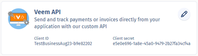

==================================
Veem Payments Integration for Odoo
==================================

Deploy the Application Code
===========================

An experienced Odoo administrator should install the code that was delivered after purchasing the app. Odoo.sh and Odoo On-Premise are supported.

Install the App
===============

#. Enter Developer Mode and open the Apps module
#. Choose the *Update Apps List* option
#. After the update is complete, search for "Veem"
#. Install the *Veem Online Payments* app

Getting Your Veem API Credentials
===================================
The following steps will help you find your API credentials in Veem. If you don't have a Veem account yet, visit http://www.blue-bird.cloud/solutions/odoo/veem to read about a special offer when opening a new Veem account.

#. Login as the user that is considered the owner of the Veem account
#. Go to Settings > Integrations and find the tile named Veem API
#. If necessary click Generate and store a copy of **Client ID** and **Client Secret**

Configure the Veem Payment Acquirer
===================================

#. If you are running a multi-company DB it is suggested you review the *Multi-Company Install Notes* section below.
#. Go to Accounting > Configuration > Payment Acquirers.
#. Find the Veem payment acquirer and run the Install process.
#. After installation, click into the Veem payment acquirer profile.
#. Ensure the Provider is Veem and set the state to Enabled. (Use Test Mode if you plan to connect to sandbox.veem.com)
#. Set a value for Company if applicable
#. Enter the **Client ID** and **Client Secret** from your Veem account
#. Make selections for the remaining options using the help tooltips for guidance
#. Save the record and then use the Test Connection feature to confirm that Odoo can connect to Veem

Sending Invoices Via Veem
==========================

- When viewing a confirmed invoice for a Company configured with a Veem Payment Acquirer you will see a Send Via Veem button

Sending Payments With Veem
==========================

- The Odoo-Veem integration uses the existing payment architecture for consistency
- If you wish to use the integration to initiate payments then follow these steps

  - Review your settings in Veem to understand which bank account is set as the Sending Account.
  - You should have a Bank Account defined in Odoo that matches that sending account.
  - Edit the journal for that bank account in Odoo and go to the Payments Configuration subtab.
  - Ensure that the Veem checkbox is checked in the Methods section of the Outgoing Payments section
  - This will offer the option of using Veem to send payment anywhere the Register Payment process is used

Multi-Company Install Notes
===========================

- It is recommended that you install the Veem Payments Integration app when logged in with access to the Odoo default company. (id=1)
- A Veem journal is added as part of the installation process and is associated with the default company.
- You should think about which company/companies will be expecting to use the Veem Payments Integration. 

  - You should create additional copies of the Veem journal for each additional company that expects to use the Veem functionality
  - After the journals are created, you will also want to create one copy of the Veem Payment Acquirer for each company
  - When following the *Configure the Veem Payment Acquirer* instructions above you should repeat those steps for each company, adding an additional step of setting the Payment Journal value on the Configuration subtab to the journal that you created for that company specified in the Payment Acquirer record.
  - If you determine that the default company does not need the Veem functions, then you might want to set that Payment Acquirer record to Disabled.
